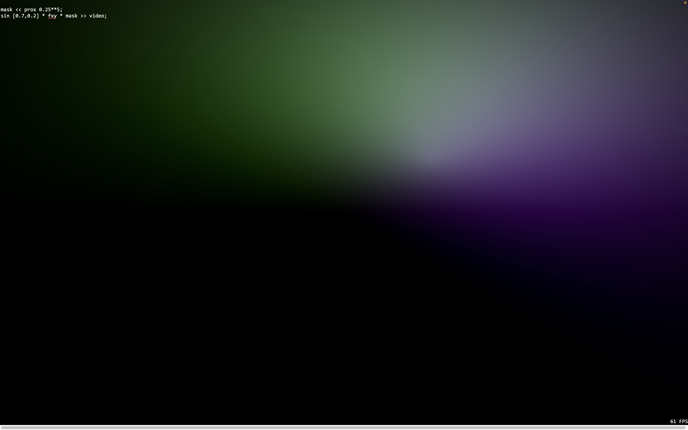
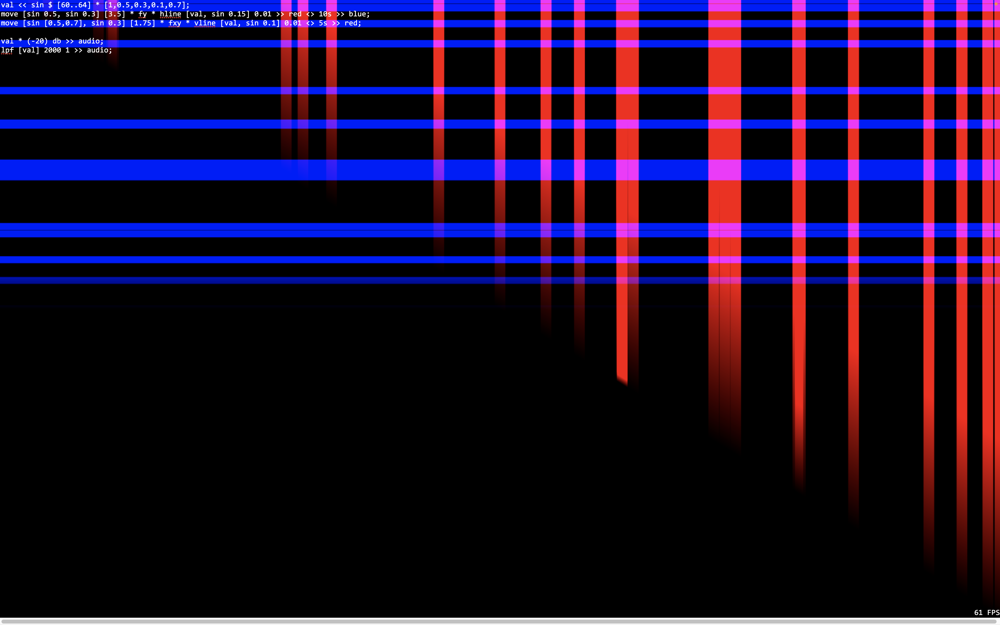
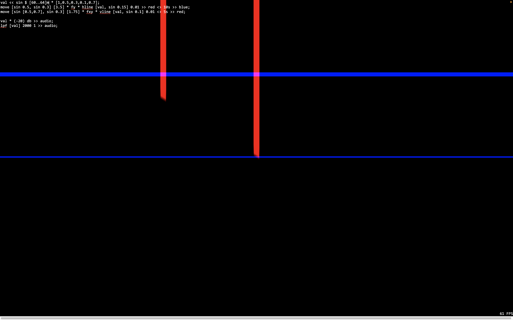
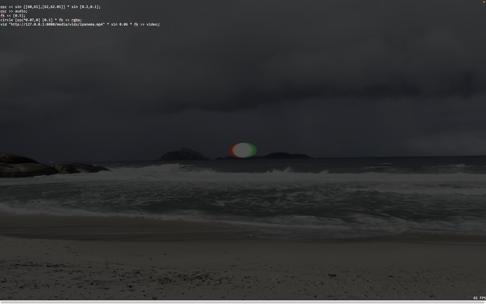
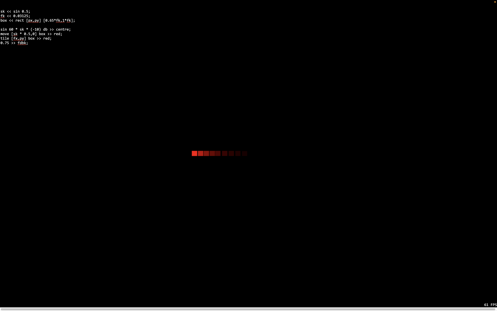

# Punctual Sandbox

Color Blooms

```haskell
mask << prox 0.25**5;
sin [0.7,0.2,0.35,0.87,-0.3] * fxy * mask >> video;
```



w/video 

```haskell
cine << vid "http://127.0.0.1:8080/media/vids/bamboo.mp4";
mask << prox 0.25**5;
sin [0.7,0.2,0.35,0.87,-0.3] * fxy * mask >> video;
cine >> video;
```


---

Musical Tendencies

```haskell
sin (midicps ([60,64,67,60.2] + (sqr 0.25 * 3))) * (-20) db >> centre;
```

with crossfade transitions over 10s

```haskell
sin (midicps ([60,64,67,60.2] + (sqr 0.25 * 3))) * (-20) db <> 10s >> centre;
```

Square phased

```haskell
sin (midicps ([60,64,67,60.2] + (sqr 0.25 * 3))) * (-20) db <> 10s >> centre;
```

My first Punctual melody

```haskell
sin (midicps ([60,64,67.2,60.2] + (sqr 0.25 * 6))) * (-20) db >> centre;
lfsaw [sin 1.5 * 1] * (-20) db >> centre;

tri (midicps ([38,42,45]) + (sqr 0.5 * 3)) * (-20) db <> 5s >> centre;
```

Bass Drum

```haskell
sin 30 * lfsaw[step [20,1.5] [2,3]] * (-20) db >> centre;
```

Default

```haskell
x1 << sin $ 0.11*[1,2]; y1 << sin $ 0.08/[3,4];
x2 << sin $ 0.06/[5,6]; y2 << sin $ 0.04*[7,8];
lines << mono $ iline [x1,y1] [x2,y2] 0.002;
col << hsvrgb [sin 0.11,0.5 ~~ 1 $ sin 0.12, 1];
mask << prox 0 ** 8;
fit 1 $ lines * col  * mask >> video <> 5;
0.98 >> fdbk
```

Lines

```haskell
val << sin $ 0.3 * [1,0.5,0.3,0.1];
move [sin 0.5,0.3] [0.5] * fxy * hline [val, sin 0.1] 0.01 >> video;
```

---

## Observations

Comparing the outcome of these two programs by changing the  ‘val’ scale from frequency to midi note frequency ‘m’.

```haskell
val << sin $ [60..64] * [1,0.5,0.3,0.1,0.7];
move [sin 0.5, sin 0.3] [3.5] * fy * hline [val, sin 0.15] 0.01 >> red <> 10s >> blue;
move [sin [0.5,0.7], sin 0.3] [1.75] * fxy * vline [val, sin 0.1] 0.01 <> 5s >> red;

val * (-20) db >> audio;
lpf [val] 2000 1 >> audio;
```

compared to:

```haskell
val << sin $ [60..64]m * [1,0.5,0.3,0.1,0.7];
move [sin 0.5, sin 0.3] [3.5] * fy * hline [val, sin 0.15] 0.01 >> red <> 10s >> blue;
move [sin [0.5,0.7], sin 0.3] [1.75] * fxy * vline [val, sin 0.1] 0.01 <> 5s >> red;

val * (-20) db >> audio;
lpf [val] 2000 1 >> audio;
```





## Audio and Audiovisual Experiments

```haskell
val << sin $ [42,38]m * [2,1,3,2,0.7];
val2 << sin $ [42,38]m * [2,1,1,2,0.7];
freq << sin 0.3;
move [sin 0.5, sin 0.3] [3.5] * fx * hline [val,sin 0.15] 0.01 >> blue;
move [sin 0.5, sin 0.3] [3.5] * fy * hline [val2,sin 0.15] 0.01 >> red;

sin [step [42m,36m,38m] [freq,freq,freq]] * (-20) db >> centre;
lpf [val] 2000 1 >> audio;
```

```haskell
val << sin $ [42,38]m * [2,1,3,2,0.7];
val2 << sin $ [42,38]m * [2,1,1,2,0.7];
freq << sin $ sin 0.002 * [sqr 0.2,sqr 0.3];
move [sin 0.5, sin 0.3] [3.5] * fx * hline [val,sin 0.15] 0.01 >> blue;
move [sin 0.5, sin 0.3] [3.5] * fy * hline [val2,sin 0.15] 0.01 >> red;

sin [step [32m,36m,38m] [freq,freq,freq]] * (-30) db >> centre;
bpf [val * (-24) db] 1800 1 >> centre;
```

Warm hum

```haskell
val << sin $ [42,38]m * [2,2,3,3,0.8];
val2 << sin $ [42,38]m * [2,2,1,2,0.8];
freq << sin $ sqr 0.3;
move [sin 0.5, sin 0.3] [3.5] * fx * hline [val,sin 0.15] 0.01 >> blue;
move [sin 0.5, sin 0.3] [3.5] * fy * hline [val2,sin 0.15] 0.01 >> red;

sin [step [32m,36m,38m] [freq,freq,freq]] * (-30) db >> centre;
val2 * (-34) db >> centre; --- transition between using val and val2
```

Another…

```haskell
val << sin $ [42,38]m * [2,2,3,3,0.8];
val2 << sin $ [42,38]m * [2,2,1,2,0.8];
freq << sin $ sqr [0.3];
freq2 << sin $ sqr [0.2];
move [sin 0.5, sin 0.3] [3.5] * fx * hline [val,sin 0.15] 0.01 >> blue;
move [sin 0.5, sin 0.3] [3.5] * fy * hline [val2,sin 0.15] 0.01 >> red;

sin [step [32m,36m,38m] [freq,freq,freq]] * (-30) db >> centre;
val2 * (-34) db >> centre;

spin [sin 2 * 0.03125] fxy >> rgb;
```

Video wobble

```haskell
osc << sin [[60,61],[62,62.01]] * sin [0.2,0.1];
osc >> audio;
fk << [0.5];
circle [osc*0.07,0] [0.1] * fk >> rgba;
vid "http://127.0.0.1:8080/media/vids/ipanema.mp4" * sin 0.06 * fk >> video;
```



```haskell
osc << sin [[64.2,72]m,[72,60]m] * sin [0.2,0.1];
osc * (-20) <> 10s >> audio;
fk << [0.75]++[sin 0.2 * 0.4];
circle [osc*0.07,0] [0.1] * fk >> rgba;
vid "http://127.0.0.1:8080/media/vids/ipanema.mp4" * fk >> video;
```


Knight Rider

```haskell
sk << sin 0.5;
fk << 0.03125;
box << rect [px,py] [0.65*fk,1*fk];

sin 60 * sk * (-10) db >> centre;
move [sk * 0.5,0] box >> red;
tile [fx,py] box >> red;
0.75 >> fdbk;
```



```haskell
cx << 0.025;
dot << circle [px,py] [0.1];

lfsaw [tile [sin 0.05, sin 0.2] dot] * 0.2 >> video;
```

Shadow Lines

```haskell
x1 << sin $ 0.11*[1,2]; y1 << sin 0.2; x2 << sin 0.3; y2 << sin 0.14;
lines << mono $ iline [x1,y1] [x2,y2] 0.02;
lines * sqr [0.5,1] * sin 0.00625 >> rgba;
```