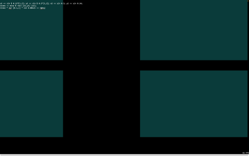

# Rhythmus 7E5 in Punctual

Rhythmus 7E5 is a composition originally made to be performed on the IceCube volumetric display. The concept behind the piece was to be a present day iteration of Richter’s 1921 visual music film Rhythmus 21, re-imagined as a generative audiovisual composition.

The following experiment is to perform this concept using the Punctual audiovisual language.

### Making Rectangles

```haskell
x1 << sin $ 0.11*[1,2]; y1 << sin $ 0.2*[1,2]; x2 << sin 0.3; y2 << sin 0.14;
lines << mono $ rect [x1,y1] [x2];
lines * sqr [0.5,1] * sin 0.00625 >> rgba;
```

`

